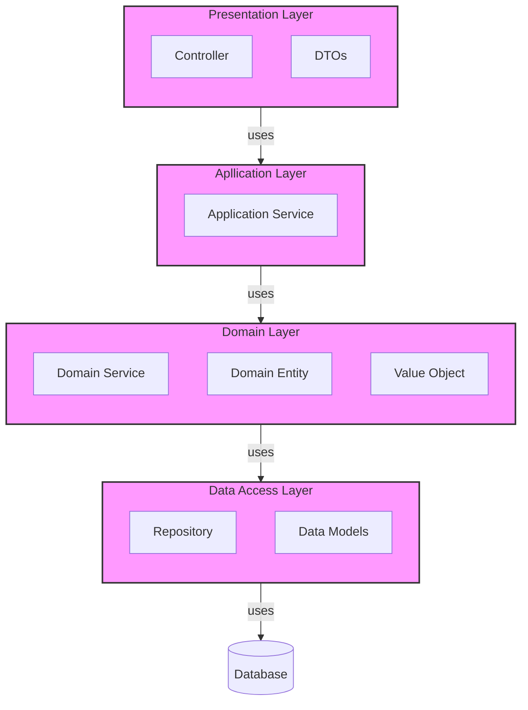

> **문서 버전:** 1.1
>
> **최종 업데이트:** 2025-01-11
>
> - **1.1** (2025-01-11): 제목 변경 
>
>    - 이전: (새로운 API 명세화 도구 선택하기 (Spring REST Docs vs Swagger))
>
>    - 이후: (새로운 API 명세화 도구 선택하기 (Spring REST Docs 대신 Swagger를 선택한 이유))
>
> - **1.0** (2025-01-11): 최초 작성 


## 기존 문서화 도구의 문제점

### Postman을 사용했던 이유

문서화 도구로 Postman을 선택했습니다. Postman은 API 테스트 솔루션으로, 자체적으로 API를 문서화할 수 있는 기능을 제공합니다.


Postman의 **높은 생산성과 접근성 덕분에 이 도구를 선택했습니다.** **API 응답을 예제로 변경할 수 있으며, `publish` 버튼을 통해 퍼블릭 웹에 배포할 수 있습니다.** 모든 기능을 무료로 제공하기 때문에 더욱 매력적인 솔루션이었습니다.


#### 스키마 정의 기능의 부재

하지만 API의 규모가 커질수록 몇 가지 한계가 드러났습니다. 가장 큰 문제는 스키마(Schema)를 정의할 수 없다는 점이었습니다. 자원을 중점으로 API를 설계하다 보면, 여러 API 응답에서 공통으로 사용하는 스키마가 많습니다.

예를 들어, 여행 일정을 추가하고 조회하는 API의 응답은 다음과 같습니다:

```http
POST /api/v2/travels/802/plans HTTP/1.1
Content-Type: application/json
{
    "placeId": 20461,
    "dayOfTravel": 2
}

HTTP/1.1 200
Content-Type: application/json
{
    "status": "success",
    "data": {
        "plans": [
            {
                "id": 154,
                "orderOfPlan": 0,
                "placeId": 20461,
                "willVisitOn": "2024-12-29"
            }
        ]
    }
}
```


이와 같은 CRUD API에서 `orderOfPlan` 필드의 이름을 `seq`로 변경할 경우, 모든 엔드포인트의 예시를 일일이 수정해야 합니다. 하지만 스키마 정의가 있었다면 `TravelPlan`만 변경해도 연관된 API 문서에 자동으로 반영될 수 있었습니다.

스키마 정의는 API 문서화에서 매우 중요한 기능이지만, Postman은 이를 지원하지 않습니다.


## 새로운 문서화 도구 선택

이에 따라 문서화 도구를 다시 선택하기로 했습니다. 조사해보니, 스프링 프로젝트에서는 Spring REST Docs와 Swagger가 널리 사용되고 있음을 알게 되었습니다.


### Swagger vs Spring REST Docs


**Swagger**는 **어노테이션 기반**으로 API 문서를 작성하는 도구입니다.

- **장점:** API 문서 작성 및 배포가 용이합니다.

  - 컨트롤러 및 DTO에 어노테이션을 추가하기만 하면 문서를 생성할 수 있습니다.

  - Swagger-UI를 통해 작성한 문서를 깔끔한 페이지로 쉽게 배포할 수 있습니다.

- **단점:** 비즈니스 로직과 명세 코드가 혼합되어 신뢰성이 떨어집니다.

  - Swagger 어노테이션이 컨트롤러 및 DTO와 혼합되어 소스 코드 이해가 어려워집니다.

  - 테스트 없이 작동하기 때문에 신뢰도가 낮습니다.


**Spring REST Docs**는 **테스트 코드를 기반**으로 API 문서를 작성하는 도구입니다.

- **장점:** 소스 코드를 온전히 보존할 수 있고, 신뢰성이 높습니다.

  - API 명세서 배포를 위해서는 테스트가 성공해야 하므로 신뢰도가 높습니다.

  - 비즈니스 로직을 온전히 보존할 수 있습니다.

- **단점:** 테스트 코드 강제 적용이 어렵고, 레퍼런스가 부족합니다.

  - 테스트 코드를 일일이 작성해야 하므로 API 명세를 작성하기 어렵습니다.


> [출처](https://tech.kakaopay.com/post/openapi-documentation/)


### Spring REST Docs는 API 요청 및 반환 정보만 보증한다

Spring REST Docs는 테스트 코드 기반으로 API 명세의 신뢰성이 높다고 설명했습니다. 하지만 저는 Spring REST Docs가 전체 API 동작을 보증하지 않는다고 생각합니다.


```java
@WebMvcTest(SampleController.class)
@AutoConfigureRestDocs
public class SampleControllerTest {

    @Autowired
    private MockMvc mockMvc;

    @Autowired
    private ObjectMapper objectMapper;

    @MockBean
    private SampleService sampleService;

  	@Test
  	void save() throws Exception {
      	// given
      	SampleSaveRequest request = new SampleSaveRequest(...);
      	SampleSaveResponse response = new SampleSaveResponse(...);
      	
      	when(sampleService.save(request)).thenReturn(response);
      	
      	// when & then
      	mockMvc.perform("/samples") 
                        .contentType(APPLICATION_JSON)
                        .content(objectMapper.writeValueAsString(request)))
                .andExpect(jsonPath("$.id").value(response.getId()))
                .andDo(print())
                .andDo(document("sample/save"));
    }
}
```

위의 코드는 Spring REST Docs 작성을 위한 테스트 코드 예시입니다. MockMvc를 활용하여 `DispatchServlet`을 Mocking해 가상의 HTTP 요청 및 응답을 구현하고 있습니다. 주목할 점은 `SampleService`를 가짜 객체로 Mocking했다는 것입니다.




레이어드 아키텍처 구조의 애플리케이션에서는 일반적으로 하위 계층을 가짜(Mocking)로 변경하여 테스트를 수행합니다. 이는 **테스트 실패 지점을 현재 테스트하는 대상으로 한정하기 위함**입니다.


만약 `Controller`를 테스트할 때 모킹(Mocking)하지 않으면 실제 DB와 `Repository`와 `Service`에 주입될 것입니다. 만약 테스트가 실패했다면, 대체 어디서 실패했는지 파악하기 어렵습니다.

- `Service` 혹은 `Repository` 에서 비즈니스 예외가 발생했을 수도 있습니다.
- 외부 데이터베이스와 연결이 불안정하거나, 실패했을 수도 있습니다.


이 때문에 테스트에서 **모킹(Mocking)은 필수 불가결한 요소**이고, 이를 단위 테스트(Unit Test)라고 합니다.


```java
@Test
void save() throw Exception {

    // given
    SampleSaveRequest reuqest = new SampleSaveRequest(...);
    SampleSaveResponse response = new SampleSaveResonse(...);

    when(sampleService.save(request)).thenReturn(response);

    // when & then
    mockMvc.perform("/samples") 
                    .contentType(APPLICATION_JSON)
                    .content(objectMapper.writeValueAsString(request)))
            .andExpect(jsonPath("$.id").value(response.getId()))
            .andDo(print())
            .andDo(document("sample/save"));
}
```

다시 Spring REST Docs 코드를 살펴보면, `SampleService`는 가짜 객체이기 때문에 **하위 비즈니스 로직은 전혀 테스트하지 않고 있습니다.** API의 **입력 및 반환 정보만을 보증**할 뿐입니다.


Spring REST Docs 테스트의 의미는 API 호출 및 반환 정보가 변경되었을 때 명세에 제대로 반영됨을 보증하는 것입니다. 제가 강조하고 싶은 것은 **Spring REST Docs가 보증하는 부분을 명확히 인식해야 한다는 점입니다.**


### Swagger의 비즈니스 코드 침투는 어느 정도 보완할 수 있다

Swagger는 어노테이션 기반으로 API 명세를 작성합니다. 따라서 **어노테이션이 너무 많고 복잡하여 코드를 이해하기 힘들다는 단점이 있습니다.**


```java
@RestController 
@RequestMapping(value = "/somepath", produces = MediaType.APPLICATION_JSON_VALUE) 
public class SomeController { 
  
    @Operation(
            summary = "해당 API를 요약하는 정보",
            description = "해당 API를 자세히 설명하는 정보"
    )
    @ApiResponses({
            @ApiResponse(responseCode = "...", description = "OK, 성공"),
            @ApiResponse(description = "예외 메세지", 
              content = @Content(schema = @Schema(implementation = ApiResponse.class))),
      			...
    })
    @PostMapping 
    public SomeObject somePostMethod( 
        @RequestBody(content = @Content( 
            examples = { 
                @ExampleObject(name = "someExample1", value = """ 
                    { 
                        "someKey1" : "someValue1", 
                        "someKey2" : "someValue2", 
                        "someKey3" : "someValue3"
                    } 
                """), 
                @ExampleObject(name = "someExample2", value = """  
                    { 
                        "someKey1" : "someValue1", 
                        "someKey2" : "someValue2", 
                        "someKey3" : "someValue3"
                    } 
                """) 
            } 
        )) 
        @RequestBody SomeRequestBody requestBody) { ... } 
}
```


Swagger를 적용한 예시 코드입니다. 명세를 위한 어노테이션이 방대하고 복잡해 컨트롤러 코드를 이해하기 어렵습니다. 그러나 **아래 방법을 활용하면 해당 단점을 어느 정도 보완할 수 있습니다.**


#### springdoc-openapi는 스프링 정보를 기반으로 API 명세를 자동 구성한다


Springdoc은 Swagger를 Spring 환경에서 사용할 수 있도록 도와주는 라이브러리입니다. 주목해야 할 점은 springdoc이 `swagger-core` 뿐만 아니라 `spring-boot-autoconfigure`를 의존한다는 것입니다.


즉, springdoc은 **스프링의 구성 정보를 기반으로 API 명세를 생성**합니다. 이 기능 덕분에 **간편하게 명세를 작성할 수 있을 뿐만 아니라, 코드 변경 시 자동으로 API 명세에 반영**됩니다.


하지만 **자동 생성된 명세의 정보가 부족해 어쨌든 어노테이션 등으로 지정해야 한다는 점은 변하지 않습니다.**


#### JavaDoc으로 API 명세를 작성할 수 있다

Swagger **어노테이션은 특정 구현(`swagger-core`)에 의존적**입니다. 그러므로 **DTO 등 전 계층에서 사용하는 객체에 적용하기 까다롭습니다**. 만약 구현체가 바뀐다면 모든 코드를 수정해야 하는 상황이 발생할 수 있습니다.

  

> springdoc-openapi는 자바독 주석과 주석을 명세에 반영할 수 있습니다:
>
> - 메서드의 자바독 주석은 `@Operation` 설명으로 지정됩니다.
> - `@return`은 `@Operation`의 응답 설명으로 지정됩니다.
> - 속성의 자바독 주석은 이에 대한 `@Schema` 설명으로 지정됩니다.
>
> [출처](https://springdoc.org/#javadoc-support)


공식 문서에 따르면, springdoc은 **JavaDoc 정보를 연동해 API 명세로 제공할 수 있습니다.** JavaDoc을 활용하면 DTO 등 전 계층에서 사용되는 객체에도 쉽게 적용할 수 있습니다.


```groovy
dependencies {
    annotationProcessor 'com.github.therapi:therapi-runtime-javadoc-scribe:0.13.0'

    // Runtime library
    implementation 'com.github.therapi:therapi-runtime-javadoc:0.13.0'
}
```

이를 위해 springdoc이 동작하는 런타임 시 JavaDoc을 읽을 수 있어야 합니다. 따라서 위와 같이 `[therapi-runtime-javadoc](https://github.com/dnault/therapi-runtime-javadoc)` 라이브러리를 추가해야 합니다.


> springdoc이 런타임에 작동하는 이유는 스프링의 자동 구성(`spring-boot-autoconfigure`) 정보를 참조해 API 명세를 작성하기 때문입니다.


```java
/**
 * 새로운 일정을 생성하기 위한 요청 객체입니다.
 * @param placeId 일정에서 방문할 장소(Place)의 식별자
 * @param dayOfTravel 일정을 수행할 여행의 일차
 *                    <ul>
 *                      <li>
 *                          시작 값은 0이며, (여행 기간 - 1)까지 지정할 수 있습니다.
 *                          (4박 5일 여행인 경우, 0부터 4까지 지정할 수 있습니다)
 *                      </li>
 *                    </ul>
 */
public record CreateTravelPlanRequest(
       @NotNull Long placeId,
       @NotNull Integer dayOfTravel
) { }
```


요청 DTO 클래스에 JavaDoc을 작성했습니다. JavaDoc에 `@param` 태그를 사용해 속성에 대한 설명과 사전 조건(pre-condition)을 기재했습니다.


생성된 API 명세서를 확인해보면, JavaDoc으로 적은 내용이 반영된 것을 확인할 수 있습니다. 이렇게 springdoc-openapi와 JavaDoc을 연동함으로써, DTO 등 객체에도 부담 없이 명세를 작성할 수 있습니다.


## 마치며

결론적으로, 새로운 명세화 도구로 `Swagger`와 `springdoc-openapi`를 선택했습니다.


1. Spring REST Docs는 **API의 요청/응답 정보만을 보증**한다고 생각합니다. 반면 springdoc 또한 **스프링의 구성 정보를 참조하므로 높은 신뢰성을 보증**합니다.

   - 물론 Spring REST Docs를 **통합 테스트로 구성하면 API의 비즈니스 로직까지 보증**할 수 있습니다. 이 경우 확실한 메리트가 있다고 생각합니다.

2. Swagger의 "명세 코드가 운영 코드에 침투된다"라는 **단점은 springdoc과 JavaDoc으로 보완**할 수 있습니다.


이번 포스팅에서는 `Swagger`와 `Spring REST Docs`를 자세히 비교했습니다. 기술 선택 시 단편적인 장단점을 파악하기보다 각 장단점이 무엇을 의미하는지, 현재 상황에 적합한지를 깊이 고민해야 한다고 느꼈습니다.


향후 `springdoc-openapi`를 활용해 자연스럽게 명세를 작성하는 방법을 찾아 기술하겠습니다.